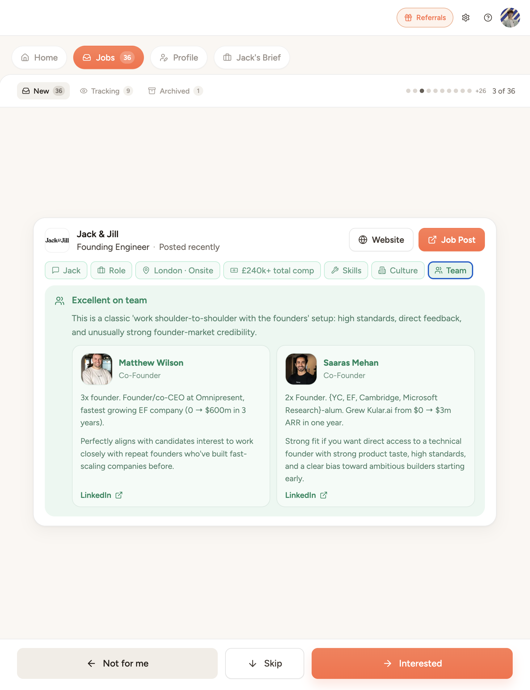
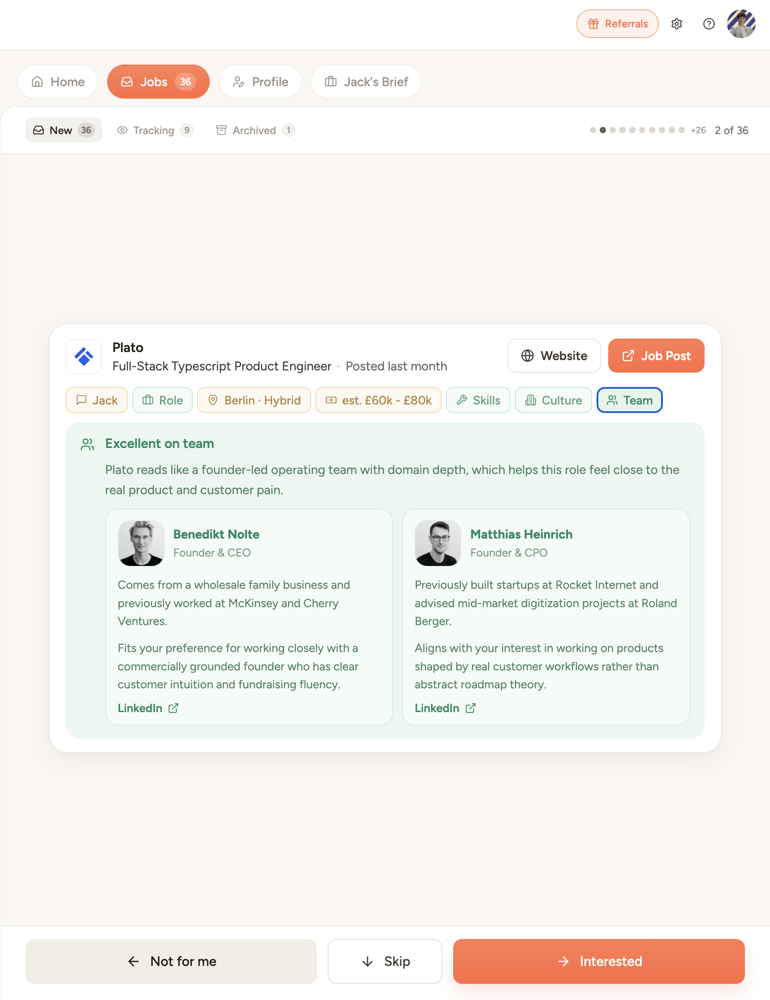
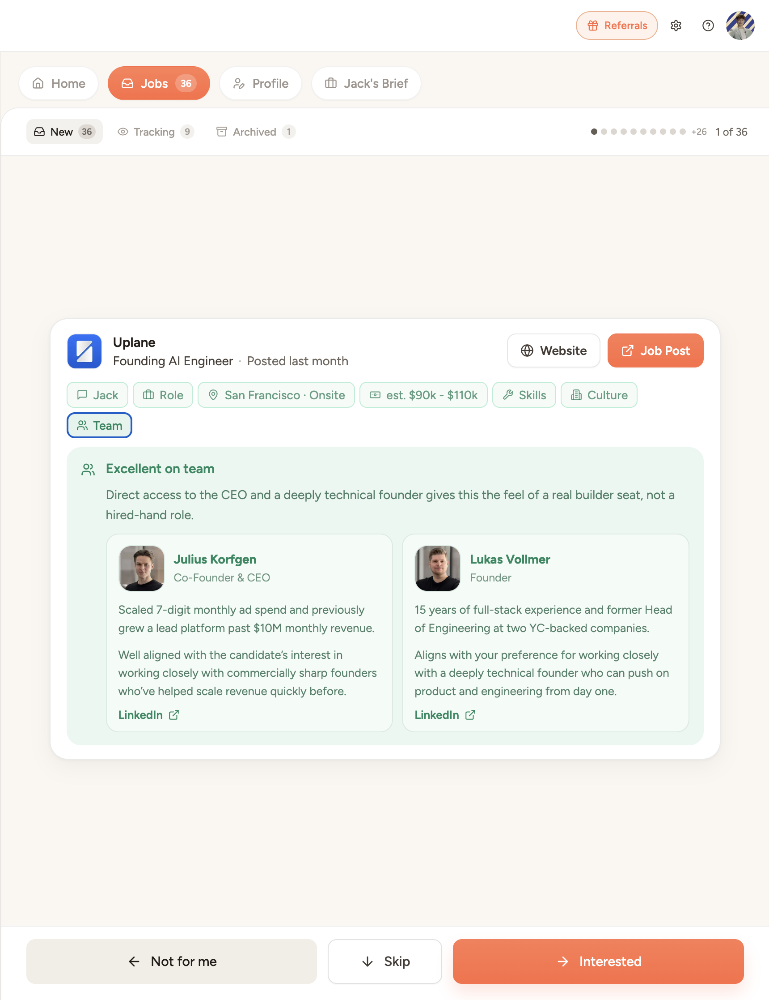

# Jack & Jill Team Tab Concept

A small product concept built in Next.js that adds a Team tab to the Jack & Jill job card, giving candidates more context on who they’d work with and why the role could be a strong fit.



## Why I built this

After using Jack & Jill for a few days, I felt one high-leverage piece of context was missing from the job view: who the candidate would actually be working with.

For ambitious candidates, team and founder quality are often a major part of the decision. This concept explores how that context could be surfaced directly inside the job card without sending users elsewhere.

## What changed

- Added a new **Team** tab to the job card
- Shows relevant founders / team members
- Adds short, decision-oriented context on why the team is strong
- Keeps the interaction inside the existing job browsing flow

## Stack

- Next.js
- TypeScript
- Tailwind CSS

## Run locally

```bash
npm install
npm run dev
```

## More examples


